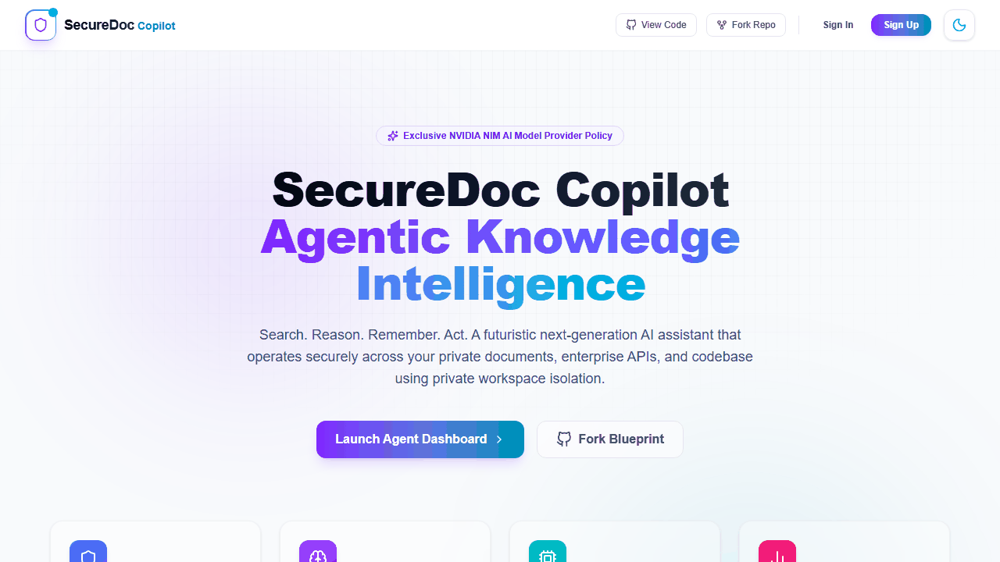
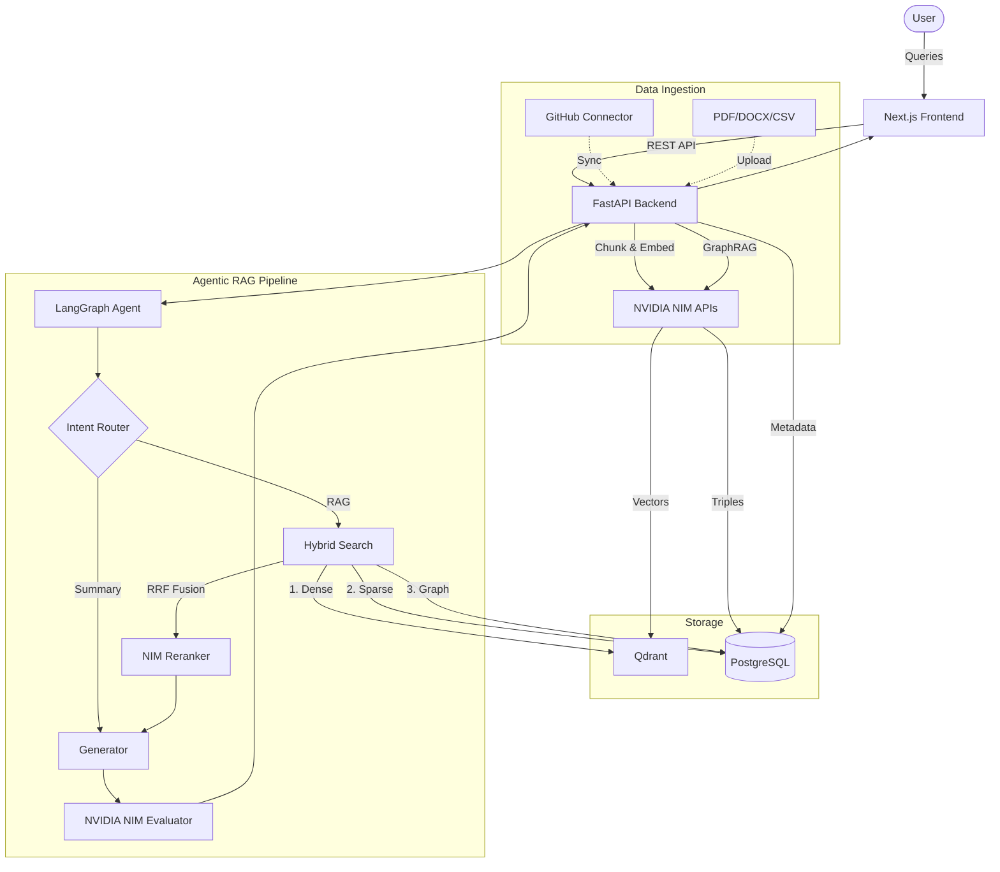
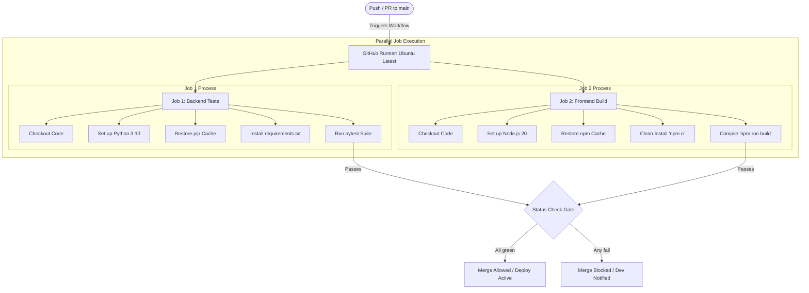
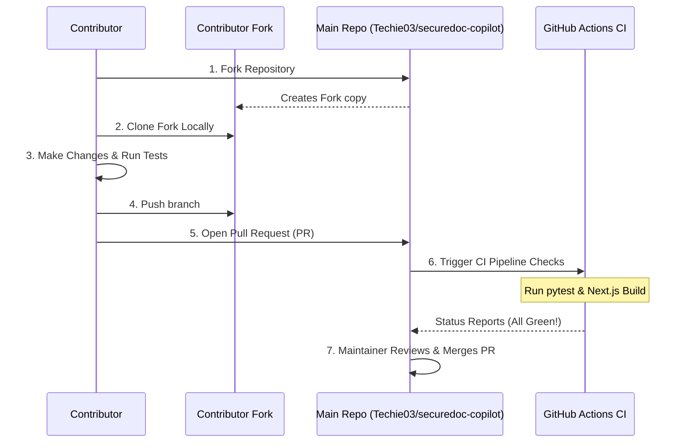

# SecureDoc Copilot — A Futuristic Next-Generation Agentic RAG Platform

> **Search. Reason. Remember. Act — securely across private knowledge.**

SecureDoc Copilot is a secure, multi-user, **NVIDIA NIM-powered** agentic RAG platform that searches, reasons, remembers, evaluates, and acts across private documents, code, and enterprise knowledge.

## 🎥 Product Demonstration

*(Here is an automated walkthrough of the SecureDoc Copilot interface)*



---

## ⚡ Architecture & Data Flow



---

## 📖 Step-by-Step Project Explanation

SecureDoc Copilot is not just another ChatGPT wrapper. It is a deeply integrated, state-of-the-art **Agentic Retrieval-Augmented Generation (RAG)** pipeline designed for enterprise security and complex reasoning. Here is exactly how it works under the hood:

### Step 1: Secure Data Ingestion & Isolation
When a user uploads a document (PDF, DOCX) or syncs a GitHub repository, the FastAPI backend immediately assigns a strict workspace ID. Data is never co-mingled. The document text is parsed and split into overlapping chunks to preserve semantic context.

### Step 2: Intelligent Entity Extraction (GraphRAG)
Before the data is even searchable, it is passed to **NVIDIA's Llama 3.1 70B** model which performs advanced entity extraction. It reads the text and pulls out structured relationships in the format of `(Subject) -> [Predicate] -> (Object)`. These "triples" are stored in PostgreSQL, creating a literal Knowledge Graph of your private data.

### Step 3: Vectorization (Dense Search)
Simultaneously, the text chunks are converted into mathematical vectors using **NVIDIA's nv-embedqa** model. These vectors are stored in the Qdrant Vector Database, allowing the system to understand the "semantic meaning" of sentences rather than just matching keywords.

### Step 4: The Agentic Query Router
When a user asks a question in the chat interface, the query doesn't go straight to a search database. Instead, an AI **Router Agent** analyzes the intent. If it's a simple greeting, it responds directly. If it requires data, it triggers the Retrieval node.

### Step 5: Hybrid Reciprocal Rank Fusion (RRF)
To find the absolute best answer, the system searches 3 different ways simultaneously:
1. **Dense Vector Search:** Looks for conceptual matches in Qdrant.
2. **Sparse Keyword Search:** Looks for exact word matches using BM25 in Postgres.
3. **Graph Traversal:** Explores the Knowledge Graph relationships extracted in Step 2.
The results from all three methods are mathematically fused and re-ranked using an **NVIDIA NIM Reranker** model.

### Step 6: Evaluated Generation
Finally, the top context is handed to the primary LLM to generate the final answer. However, before it is sent back to the user, an independent **Evaluator Agent** reviews the answer to ensure it is *Faithful* (no hallucinations) and *Relevant* (actually answers the question). If it passes, the user receives their highly-accurate response!

---

## 🚀 Key Features

| Feature Area | Description |
|---|---|
| **Agentic Workflow** | LangGraph-based state machine routing queries to RAG, summary, or conversational nodes. |
| **Hybrid Search (RRF)** | 3-signal fusion: Qdrant dense vectors + PostgreSQL BM25 + GraphRAG entity expansion. |
| **GraphRAG Extraction** | Automated entity/relationship extraction via NIM, stored as knowledge graph triples. |
| **Data Connectors** | Ingest public/private GitHub repositories directly into the RAG pipeline. |
| **Semantic Memory** | User-level and workspace-level memory extraction and persistence. |
| **Evaluations Telemetry** | Built-in RAG triad scoring (Faithfulness, Relevance, Hallucination checks). |
| **Workspace Isolation** | Strict RBAC and payload-level isolation for multi-tenant data security. |
| **Cyberpunk UI** | Glassmorphic design with micro-animations, built on Next.js 16 and Tailwind v4. |

---

## 🤖 Model Provider Policy (NVIDIA NIM ONLY)

**All AI model inference in SecureDoc Copilot uses NVIDIA NIM APIs exclusively.**
There are no fallbacks to OpenAI, Anthropic, or Gemini.

| Capability | NVIDIA NIM Model Used | Purpose |
|---|---|---|
| **Primary LLM Generator** | `meta/llama-3.1-70b-instruct` | Answer generation, summaries, logic. |
| **Embeddings** | `nvidia/nv-embedqa-e5-v5` | Dense vector generation for Qdrant. |
| **Reranking** | `nvidia/nv-rerankqa-mistral-4b-v3` | Final re-ordering of RRF candidates. |
| **Intent Router** | `meta/llama-3.1-8b-instruct` | Fast, low-latency query classification. |
| **Evaluator** | `meta/llama-3.1-70b-instruct` | Strict scoring of RAG triad metrics. |
| **GraphRAG Extractor** | `meta/llama-3.1-70b-instruct` | Structured JSON extraction for triples. |

---

## 🛠️ Detailed Technology Stack

Our stack is carefully curated to balance ultra-modern, high-performance web tooling with secure, robust enterprise-ready databases and AI orchestrators.

| Layer | Component | Version | Role & Selection Rationale |
| :--- | :--- | :--- | :--- |
| **Frontend** | **Next.js** | `16.2.6` | App Router for unified SSR/ISR/Client rendering, server components, and directory-based routes. |
| | **React** | `19.2.4` | Modern functional UI components utilizing concurrent features and advanced hooks. |
| | **Tailwind CSS** | `v4.0.0` | CSS-first configuration engine delivering sub-millisecond utility compiles and native CSS variable integration. |
| | **Framer Motion** | `^12.40.0` | Physics-based animations and layout transitions for micro-interactions. |
| | **Lucide Icons** | `^1.16.0` | Clean, customizable SVG icons designed for modern user interfaces. |
| **Backend** | **FastAPI** | `0.100.0+` | High-performance asynchronous API layer with automatic OpenAPI Swagger generation. |
| | **LangGraph** | `0.0.20+` | Advanced agentic state-machine orchestration with cycle management and conversational persistence. |
| | **SQLAlchemy** | `2.0.0+` | Modern Python SQL toolkit and ORM with strict type mapping and optimized relation loading. |
| | **Pydantic** | `2.0.0+` | Ultra-fast data validation and serialization based on Python type hints. |
| **Databases** | **PostgreSQL** | `15+` | Relational state management, vector embeddings metadata, and full-text sparse (BM25) search. |
| | **Qdrant** | `1.3.0+` | Scalable production-grade Vector DB for dense embedding indexing and cosine similarity filters. |
| | **Redis** | `4.6.0+` | Distributed session locking, ephemeral key storage, and rate-limiting. |
| **Security** | **PyJWT** | `3.3.0+` | JSON Web Token (JWT) encoding and decoding middleware with SHA256 signatures. |
| | **Bcrypt** | `4.0.0+` | Cryptographic password hashing to safeguard account credentials in the database. |
| **Inference** | **NVIDIA NIM** | *Latest* | High-throughput GPU inference microservices hosting Llama 3.1, nv-embedqa, and reranking APIs. |
| **Hosting** | **Vercel** | *Managed* | Serverless global CDN delivery and continuous deployment for the Next.js frontend. |
| | **Hugging Face** | *Container* | Spaces hosting the FastAPI container securely under an isolated runtime environment. |

---

## 🔄 CI/CD Pipeline (GitHub Actions)

We use **GitHub Actions** to enforce strict continuous integration (CI) gates, preventing faulty code, compile errors, or breaking database schemas from reaching the live application. The workflow is automatically triggered on every **Push** and **Pull Request** targeting the `main` branch, running on the configuration defined in [ci.yml](file:///.github/workflows/ci.yml).

### Execution Flow & Architecture



### Detailed Job Explanations

#### 1. Backend Verification (`backend-test` job)
* **Environment**: `ubuntu-latest` running a clean Python 3.10 virtual environment.
* **Dependencies**: Installs core frameworks from `apps/api/requirements.txt` along with testing utilities (`pytest` and `httpx`).
* **Checks**:
  * Runs python syntax audits and verifies structural typing.
  * Launches `pytest` to execute all integration tests, validating model schemas, token encryption, and router configurations.
  * **Failure Criteria**: If a database foreign key constraint fails, or a NIM API wrapper responds incorrectly, the pipeline immediately halts and blocks the PR from merging.

#### 2. Frontend Verification (`frontend-build` job)
* **Environment**: `ubuntu-latest` running Node.js 20.
* **Dependencies**: Leverages GitHub Actions dependency caching based on `apps/web/package-lock.json` to prevent repeating expensive package downloads. It then runs `npm ci` for a deterministic, clean-room install.
* **Checks**:
  * Compiles the React codebase using the Next.js compiler `next build`.
  * Enforces ESLint guidelines for code formatting and accessibility correctness.
  * Validates complete TypeScript compilation (ensures there are no type mismatches or unsafe `any` casts).
  * **Failure Criteria**: If a React component has invalid typescript props or fails to build as a production bundle, the build job aborts.

#### 3. Automated Continuous Deployment (CD)
* **Frontend**: Once the GitHub Action status check turns green, Vercel picks up the new commit, builds it, and pushes it live to the production domain.
* **Backend**: Hugging Face Spaces rebuilds the backend Docker image using the updated commits from `main`, starting the new uvicorn service container on port `7860`.

---

## 💻 Quick Start Guide

Follow these steps to run the entire stack locally with Docker Compose and hot-reloading development environments.

### 1. Prerequisites
- **Docker & Docker Compose** (version 2.20.0+ recommended)
- **Node.js** (version 18+ or 20+)
- **Python** (version 3.10+)
- An active [NVIDIA API Key](https://build.nvidia.com/explore/discover)

### 2. Environment Configuration
Clone the repository, create a local environment file, and add your API tokens:
```bash
# Clone the repository
git clone https://github.com/Techie03/securedoc-copilot.git
cd securedoc-copilot

# Set up environment variables
cp .env.example .env
# Open .env in your text editor and specify your NVIDIA_API_KEY
```

### 3. Spin Up Infrastructure Services
Start the database and vector storage containers in detached mode:
```bash
docker compose up -d
```
This spawns:
- **PostgreSQL** on `localhost:5432` (Relational DB)
- **Qdrant Vector DB** on `localhost:6333` (Vector DB)
- **Redis** on `localhost:6379` (Caching & Memory)

### 4. Launch Backend Development Server
Set up a Python virtual environment and run the FastAPI server:
```bash
cd apps/api
python -m venv venv

# Activate the virtual environment
# On Linux/macOS:
source venv/bin/activate
# On Windows:
venv\Scripts\activate

# Install requirements & run
pip install -r requirements.txt
uvicorn app.main:app --reload --port 8000
```
Your backend will be available at `http://localhost:8000` (with documentation at `http://localhost:8000/docs`).

### 5. Launch Frontend Development Server
Install npm packages and start the Next.js development server:
```bash
cd apps/web
npm install
npm run dev
```
Visit `http://localhost:3000` in your web browser to access the frontend dashboard!

---

## 📦 Deployment Configs

### Frontend (Vercel)
Deploys dynamically via Vercel integration:
- Environment variables: `NEXT_PUBLIC_API_URL` (pointing to the backend), `NEXT_PUBLIC_GITHUB_CLIENT_ID`, and `NEXT_PUBLIC_GOOGLE_CLIENT_ID` are configured in the Vercel Project Dashboard.

### Backend (Hugging Face Spaces)
The API runs inside a Docker container defined in [Dockerfile](file:///apps/api/Dockerfile).
- Container Port: Hugging Face routes incoming traffic to port `7860`. The container starts uvicorn on port `7860`.
- All credentials (`DATABASE_URL`, `QDRANT_URL`, `NVIDIA_API_KEY`, etc.) are injected securely by the Hugging Face secret engine as system environment variables.

---

## 🤝 Open Source Contribution Guide

We love open-source and welcome contributions from the community! To ensure high-quality code and prevent regressions, please follow these step-by-step contribution guidelines:

### Contribution Lifecycle



### Detailed Walkthrough

#### Step 1: Fork and Clone
1. Navigate to [Techie03/securedoc-copilot](https://github.com/Techie03/securedoc-copilot).
2. Click the **Fork** button in the top-right corner to create your own copy of the repository.
3. Clone your personal fork to your local system:
   ```bash
   git clone https://github.com/YOUR_GITHUB_USERNAME/securedoc-copilot.git
   cd securedoc-copilot
   ```
4. Set up the original repository as your `upstream` remote so you can stay in sync with latest changes:
   ```bash
   git remote add upstream https://github.com/Techie03/securedoc-copilot.git
   ```

#### Step 2: Syncing with Main
Always pull the latest changes from upstream before starting a new feature:
```bash
git checkout main
git fetch upstream
git merge upstream/main
```

#### Step 3: Branching & Development
Create a descriptive feature or bugfix branch:
```bash
git checkout -b feature/amazing-new-feature
```
*Tip: Keep your commits atomic and write clear, concise commit messages following [Conventional Commits](https://www.conventionalcommits.org/en/v1.0.0/).*

#### Step 4: Running Tests Locally
Before pushing your code, you **must** run automated checks locally to guarantee the CI pipeline will pass:

1. **Verify Backend Tests**:
   ```bash
   cd apps/api
   pytest
   ```
2. **Verify Frontend Compilation**:
   ```bash
   cd apps/web
   npm run build
   ```
3. **Verify Local Integration Pipeline**:
   Ensure your local docker containers are running, then test the document parsing, vector indexing, and graph extraction:
   ```bash
   cd apps/api
   python test_ingestion_pipeline.py
   ```

#### Step 5: Submission & Review
1. Push your branch to your GitHub fork:
   ```bash
   git push origin feature/amazing-new-feature
   ```
2. Go to the original [Techie03/securedoc-copilot](https://github.com/Techie03/securedoc-copilot) repository.
3. Click the **Compare & pull request** button.
4. Provide a clear summary explaining:
   - What changes were made.
   - Any visual adjustments (include screenshots or GIFs if appropriate).
   - Confirming that all local tests passed.
5. Submit the PR. A maintainer will review your code and merge it once the CI checks complete successfully!

---

## 📄 License

This project is licensed under the terms of the MIT License. See [LICENSE](file:///LICENSE) for more details.

