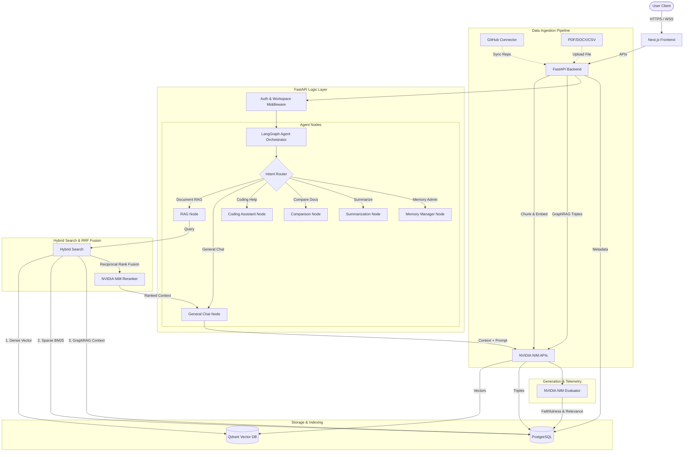

# SecureDoc Copilot - System Architecture

SecureDoc Copilot is a secure, multi-user, NVIDIA NIM-powered agentic RAG platform for private document intelligence and enterprise knowledge assistance.

## Overview

The platform uses a decoupled client-server architecture:
1. **Next.js Frontend:** A highly interactive, animation-rich dashboard implementing workspace isolation, chat history, document libraries, connectors, memory settings, and evaluation logs.
2. **FastAPI Backend:** A high-performance REST API orchestrating document extraction, GitHub ingestion, embedding, vector search, database state, and the LangGraph multi-route agent system.
3. **NVIDIA NIM APIs:** Serving as the exclusive provider of LLM generation, text embedding, intent classification, query rewriting, reranking, citation verification, hallucination checks, evaluation scoring, and GraphRAG extraction.

## Full System Architecture Diagram

## Component Breakdown

### 1. Next.js Frontend (`apps/web/`)
- **Routing:** App Router for pages like `/dashboard`, `/chat`, `/documents`, `/connectors`, `/memory`, and `/evaluations`.
- **Styling:** Tailwind CSS v4 with premium glassmorphism, glowing accents, and smooth layouts.
- **Animations:** Framer Motion powering navigation transitions, modal appearances, and micro-interactions.
- **Data Fetching:** Fetch API with context providers for API synchronization and state management.

### 2. FastAPI Backend (`apps/api/`)
- **Web Framework:** FastAPI + Uvicorn for asynchronous requests.
- **ORM:** SQLAlchemy with SQLite/PostgreSQL managing relational entities (Workspaces, Users, Documents, Triples).
- **Agent Framework:** LangGraph and LangChain orchestrating complex cyclical RAG and agent actions with persistent memory state.
- **NIM Client:** Custom lightweight async HTTPX client wrapping the NVIDIA NIM API for lower latency and total control.

### 3. Retrieval & Search (Hybrid RRF)
The system retrieves documents by fusing three distinct signals:
1. **Dense Search:** Cosine similarity against Qdrant vector space.
2. **Sparse Search:** Full-text BM25 search on document chunks in PostgreSQL using `to_tsvector` and `ts_rank`.
3. **GraphRAG:** Entity/relationship expansion via NVIDIA NIM extracted triples stored in PostgreSQL.

These three lists are merged using **Reciprocal Rank Fusion (RRF)**, yielding a highly accurate, composite relevance score. The top candidate chunks are then passed through the **NVIDIA NIM Reranker** for final LLM-guided sort.

### 4. Enterprise Workspace Security
- **Isolation:** Users must belong to a workspace. Middleware checks JWT claims to verify permissions.
- **Retrieval Security:** Qdrant collections filter vector searches dynamically by passing the `workspace_id` in the `must` filter clause. GraphRAG and Sparse queries are strictly scoped by `WHERE workspace_id = ?`.
- **Audit Trails:** Database schemas track all document activities, GitHub connector syncs, chat runs, and evaluation metrics.
